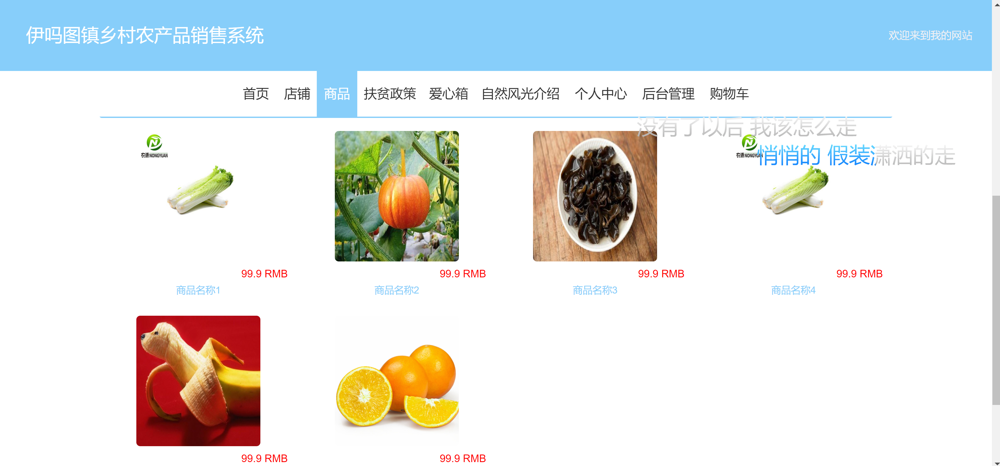
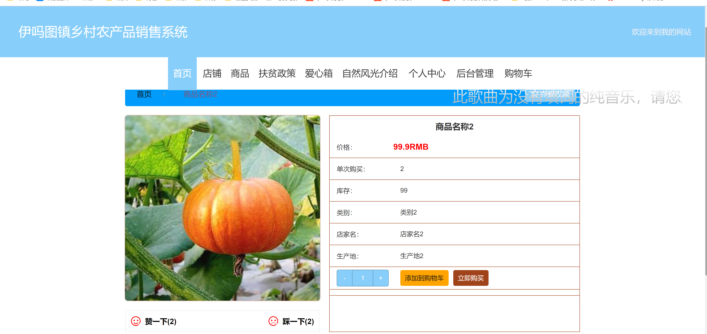
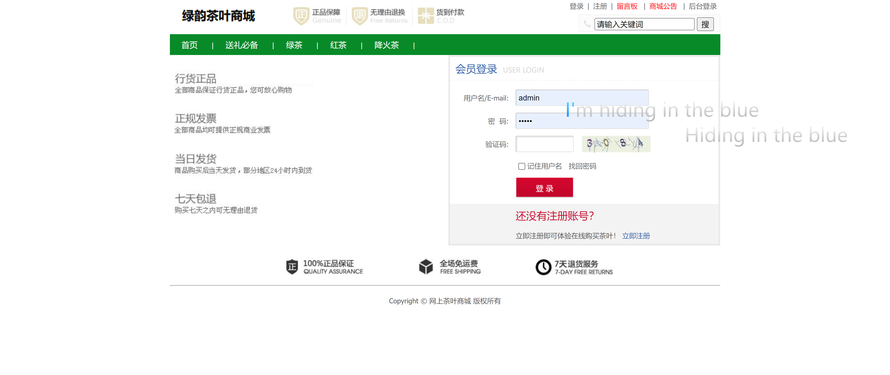
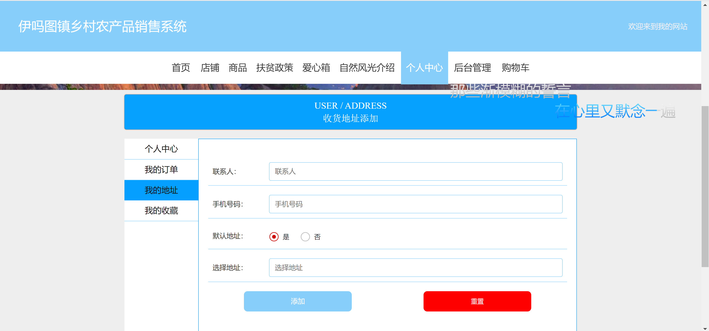
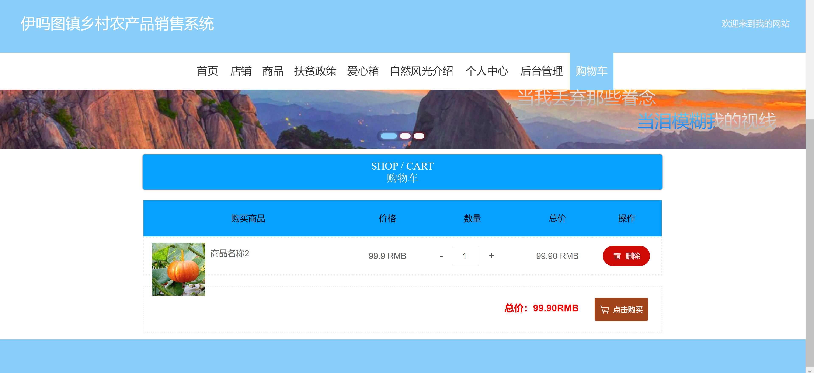
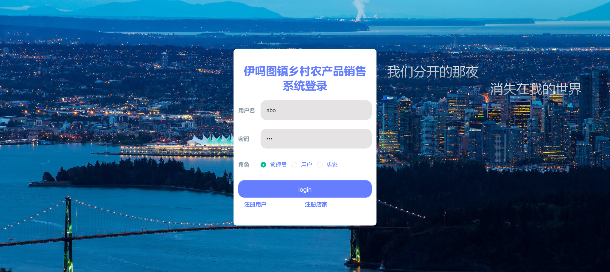
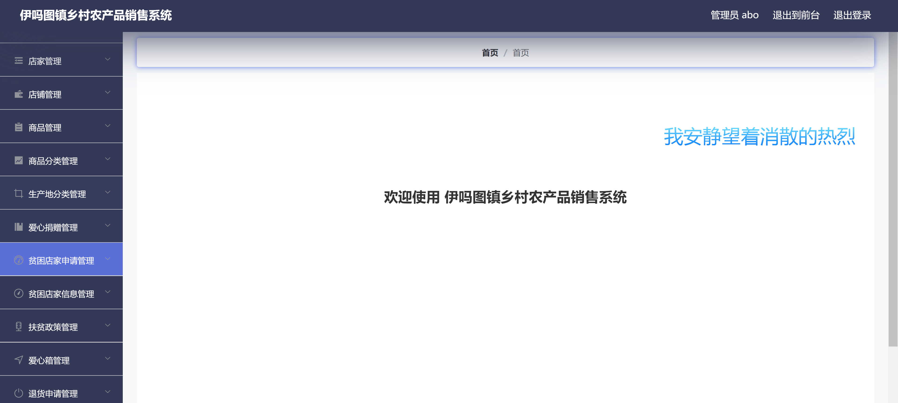
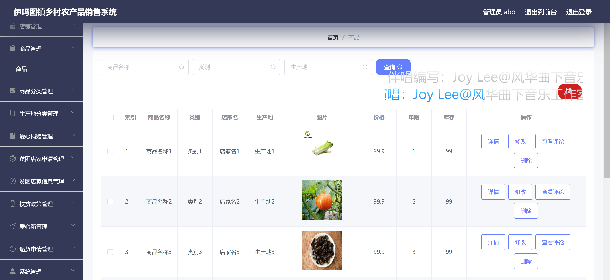
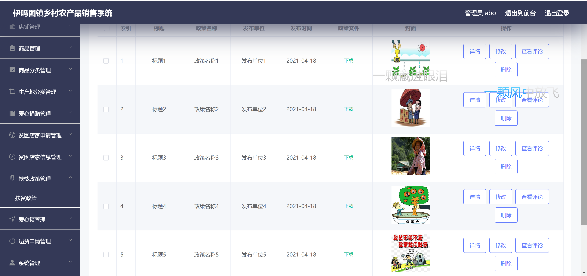

<h1 align="center">乡村农产品销售管理系统</h1>

## 简介
乡村农产品销售管理系统：角色分为管理员、用户、店家；功能包括订单管理、地址管理、商品管理、扶贫政策管理、购物车和用户登录注册，旨在促进农产品销售和支持扶贫工作。    --计算机毕业设计源码；毕设源码；java毕业设计源码

## 联系方式

<h3 align="center">获取完整代码与数据库文件 + 微信：bysj5151 QQ: 86050149 QQ群: 783742310</h3>

<h3 align="center">可帮忙远程部署 包运行成功！提供远程部署、修改代码、设计文档指导、代码讲解等服务！</h3>

## 功能介绍（完整见运行截图）
管理员：管理员通过登录注册和退出功能访问系统，管理店铺展示、商品、商品分类、生产地、扶贫政策和退货申请等多项功能。管理员可以查看和管理商品列表，进行商品添加、修改和删除等操作，也能查看商品评论，还可发布和管理扶贫政策详情。

用户：用户可通过登录和注册功能进入系统，浏览网站，通过导航栏访问首页、商店、商品及扶贫政策等。用户可以查看商品详情，选择购买数量，添加至购物车或直接购买，并可在购物车中管理商品数量或价格。在个人中心，用户可以管理订单、地址和收藏，还可查看购物车以便完成网上支付。

店家：店家使用系统可进行店铺和店家信息管理，包含商品信息发布与修改、库存管理及商店相关资料更新。店家可以参与扶贫政策，申请贫困店家资格和查看店铺的收藏以及用户评论，全方位对店铺进行操作管理。

超级管理员：超级管理员具有平台所有模块的权限，包括全局配置和平台稳定运行的管理。超级管理员能管理不同角色和权限分配，以及查看和导出数据统计分析结果，确保平台健康有效的运营，支持扶贫政策和爱心活动的全面落实。

## 运行截图

本代码来源于网络,仅供学习参考使用!

